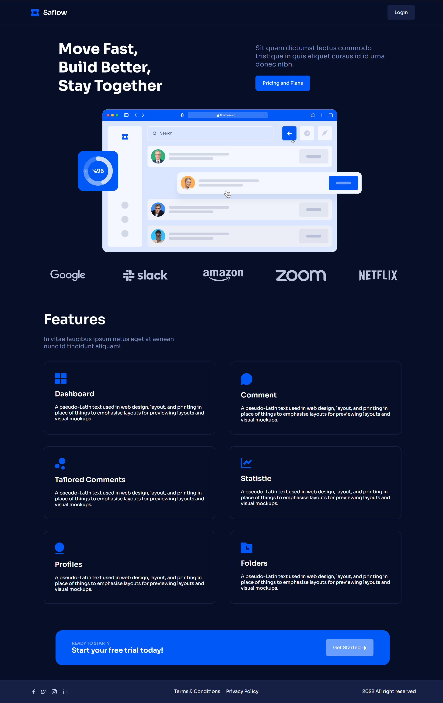
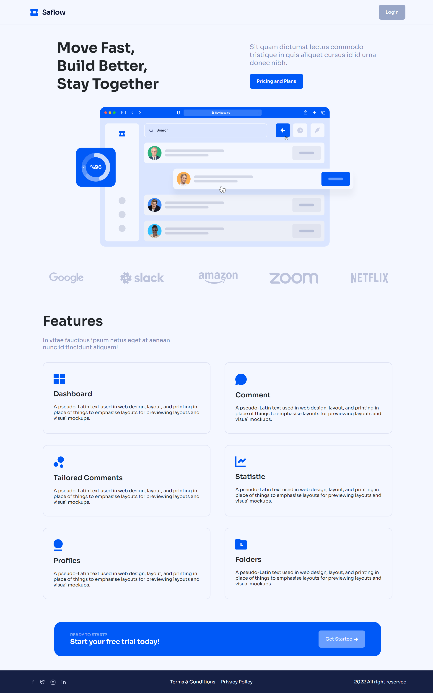

# Saflow
Saflow is an responsive website build on modern UI styling standards. View the website [live](https://ihasfishandchips.github.io/)

## Features

Responsive Design:

 - The UI is responsive to all screen sizes, be it your iphone, ipad or your laptop !
 - Smooth animations enhance the user experience.
 - Supports both Light and Dark mode. (Light/Dark mode is turned on/off based on your system theme)

## How to use this

Clone or [download a release](https://github.com/IHasFishAndChips/Saflow/)

 - [ ] Open `index.html` in your favorite text editor and launch the live server on the root folder.

---

# Website Screenshots/Videos

View the website live in action [here](https://ihasfishandchips.github.io/)

   

## Desktop - 1024px

## Tablet - 768px

## Mobile - 640px

## Author

[Kamakshya Nanda](https://github.com/IHasFishAndChips/) 

